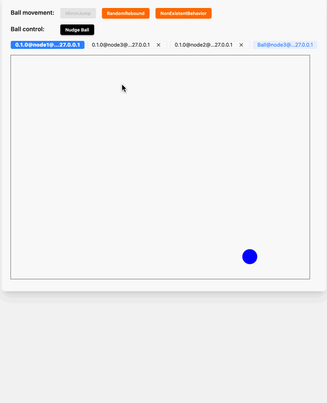
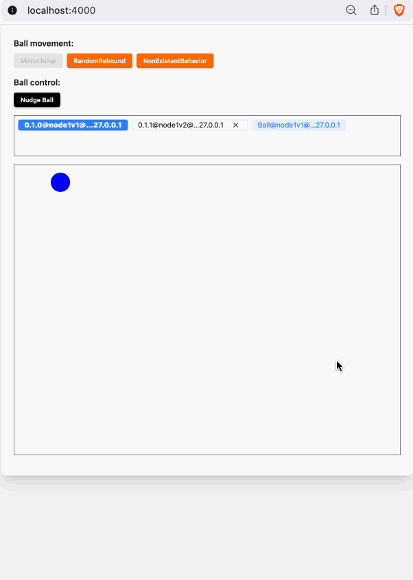
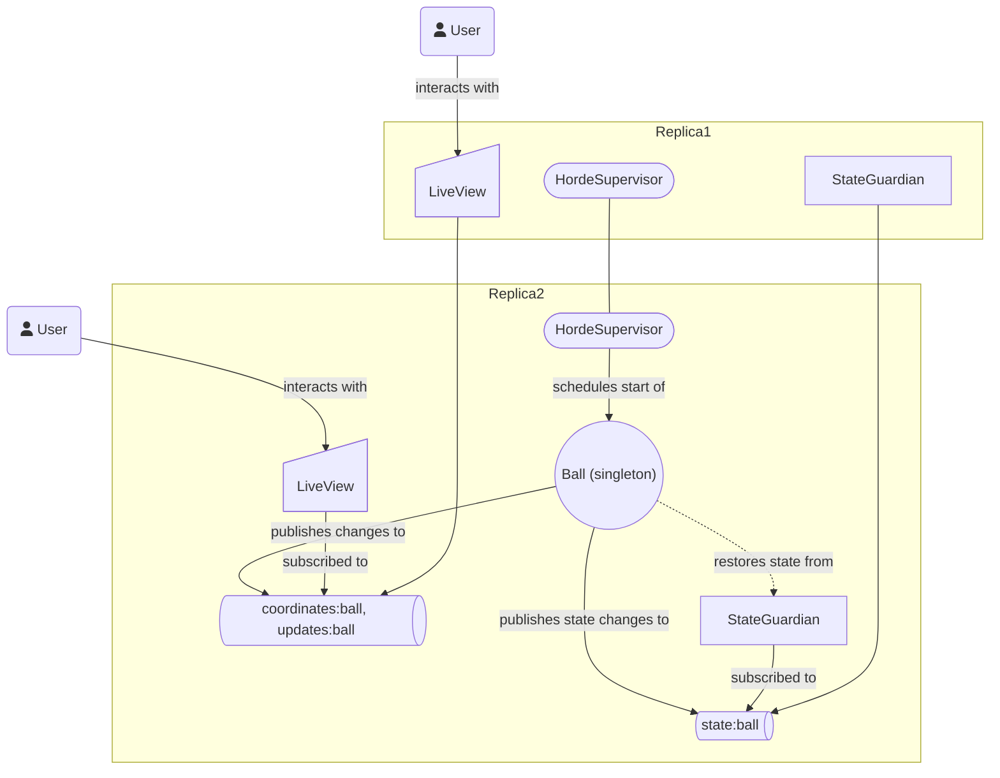

# Robust SVG-based Live View Animated

## Disclaimer

- **demoware**
- built with assistance of [GitHub Copilot](https://github.com/features/copilot)

## Motivation

- practice patterns for SVG animation on the server
  - [reduce the size of the updates](./docs/img/minimal-live-updates.png) via updating only the transform:
  - extract and use SVG components
- practice [OTP processes](https://elixirschool.com/en/lessons/advanced/otp_concurrency) that externalize their state
  to support an minimal-interruption restart. Demonstratable via fault injection
- practice injecting larger faults such as node failures
- investigate GitHub Copilot-assisted coding in Elixir
- practice writing mix tasks, e.g. to [bump the app version](./lib/mix/tasks/bump_version.ex)
- practice a whole application hot code upgrade without directly using a known ["advanced"](https://hexdocs.pm/mix/Mix.Tasks.Release.html#module-hot-code-upgrades) [approach](https://blog.appsignal.com/2021/07/27/a-guide-to-hot-code-reloading-in-elixir.html).

## Functionality

- a virtual ball is flying around in a box
- its behavior can be changed at run-time
- various system failures can also be triggered/simulated
- it is expected that the ball continues the movement without a noticeable interruption as long there's one machine available



## How to Run

### In Docker Locally

```shell
docker compose up
```

&darr;

[http://localhost:4000](http://localhost:4000)

### With Elixir

```shell
# once
mix setup

# one node
mix phx.server

# 3 nodes
process-compose
```

&darr;

[http://localhost:4000](http://localhost:4000)

- use [`process-compose`](https://github.com/F1bonacc1/process-compose) to start 3 nodes locally &rarr; (additional node ports: `4001`, `4002`)

### Hot Code Updates

- the demo fix: the new version contains a new ball movement module: [`RandomReboundV2NonSticky`](./lib/ssr_robust_live_svg/actor_behaviors/random_rebound_v2_non_sticky.ex)
- [`release-two-versions.sh`](./scripts/release-two-versions.sh) simulates the build of two versions with one compiled without the new module. The new behavior name is pre-configured and added in a particular version for the demo.
- demo
  - start two versions running alongside in a cluster
  - look at the views of both versions, noting the new module
  - try to switch over to the new module while the ball runs on the old instance &rarr; safe failure
  - take down the old node &rarr; the new node takes over but still running the old behavior
  - switch over to the new behavior

using `process-compose`:

```shell
scripts/release-two-versions.sh
scripts/run-two-versions.sh
```

&darr;




## Architecture

- the application is clustered
- a singleton process [`Ball`](./lib/ssr_robust_live_svg/actors/ball.ex) runs on one of the nodes in the cluster
- the ball is flying around in a box with an injectable behavior, fulfilling a [`BallMovement`](./lib/ssr_robust_live_svg/protocols/ball_movement.ex) protocol
- the list of movement behavior modules can be found in the [config `:available_ball_behaviors`](./config/config.exs)
- the config includes one non-existent module `NonExistentBehavior` which simulates a sub-system update fault
- the nodes (**dangerously** &rarr; demoware!) expose a kill switch which stops a node with an non-zero exit code, triggering a restart of the ball process on another node
- the state of the ball is continuously externalized to a simple process called [`StateGuardian`](./lib/ssr_robust_live_svg/state_guardian.ex), local to each node
- when the ball starts, it may load its state from the `StateGuardian`
- the svg is rendered as a live view template, updating its position only
- the list of nodes is updated periodically by [`ClusterInfoServer`](./lib/ssr_robust_live_svg/cluster_info_server.ex)

## Details

- deployable on [fly.io](https://fly.io), see [`fly.toml`](./fly.toml)

## Architecture at a Glance



## Trade-Offs

- Will it scale? &rarr; What do you mean by 'scale' exactly?
- Why publish each ball state to the state guardian? Isn't it too chatty/expensive? &rarr; Yes. I wanted to demo simulating a whole node going down on which the singleton ball is running. Without it, the take-over of the ball by another node wouldn't look that spectacular.
- Why not use technology XYZ for this? &rarr; Yes. That'd be nice, although, Phoenix LiveView, Elixir and Erlang provide so many primitives out of the box, making such architectural sketches effective, requiring fewer infrastructural moving parts.
  - One could do this in C! &rarr; Sure! You'd just have to implement ["half of Erlang"](https://rvirding.blogspot.com/2008/01/virdings-first-rule-of-programming.html) yourself. Spoiler alert: a big chunk of [Erlang/OTP is C](https://github.com/erlang/otp/blob/master/erts/emulator/beam/erl_process.c)
- Why not just use the standard Erlang/OTP mechanism for the hot code upgrade? &rarr; Yes, that'd be nice as well, and has been tried and tested all around the world. Many articles and docs on the subject suggest trying alternative approaches these days. Knowing something is possible and having tried it may lie far apart.
- Why not demo XYZ as well? &rarr; Yes, that'd be nice too. There's no-one to stop you from doing it.
